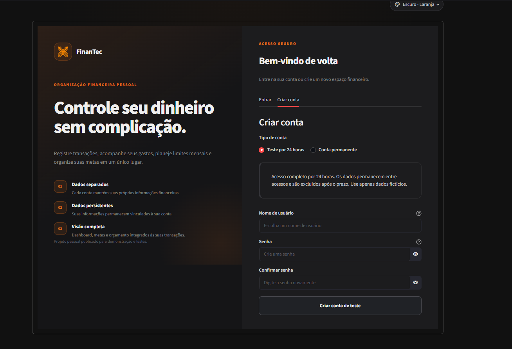
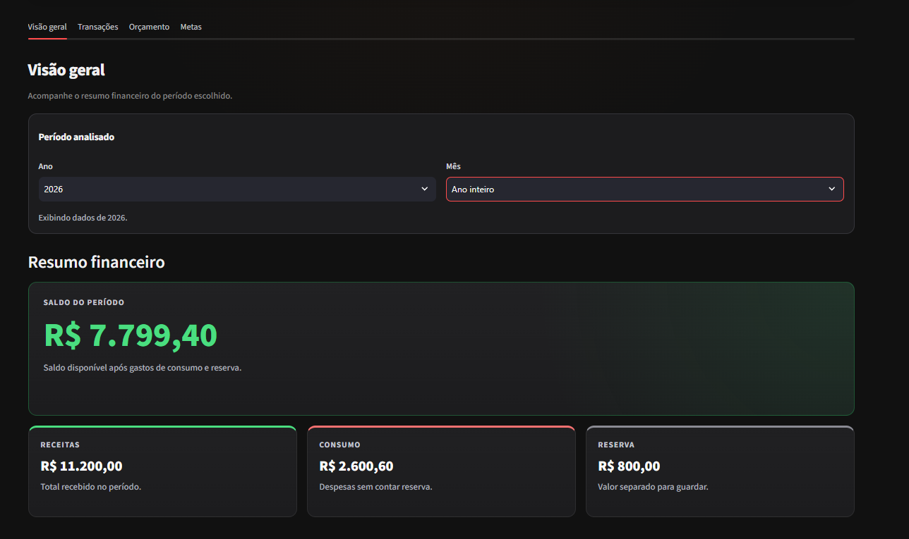
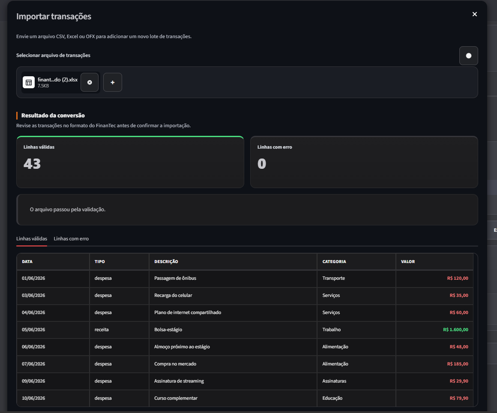
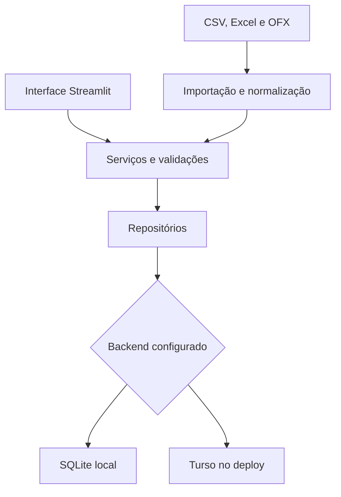

# FinanTec

<p align="center">
  
</p>

Aplicação web de organização financeira pessoal desenvolvida com Python,
Streamlit e pandas, com persistência em SQLite ou Turso.

O FinanTec reúne controle de transações, importação de arquivos, orçamento
mensal, metas financeiras e perfil em uma interface responsiva.

**[Acessar a demonstração pública](https://finantec-data-pipeline-immggyug2jwy78khudpv2s.streamlit.app/)**

---

## Como testar

Na tela de cadastro, selecione **Teste por 24 horas** e crie um usuário e uma
senha. Essa opção:

- não exige código de acesso;
- libera os fluxos funcionais da aplicação;
- mantém os dados entre acessos durante 24 horas;
- exibe o tempo restante dentro do aplicativo;
- exclui a conta e seus dados associados após o prazo.

> [!IMPORTANT]
> A demonstração pública é destinada a testes com dados fictícios. Não informe
> dados bancários, documentos ou outras informações sensíveis.

Contas permanentes são separadas das contas temporárias e só podem ser criadas
com um código de acesso.

---

## Interface

### Cadastro temporário



### Visão geral



### Importação e validação



## Sobre o projeto

O projeto começou como um pipeline ETL para transformar arquivos de transações
em dados padronizados. A evolução da V1 incorporou esses fluxos a uma aplicação
com autenticação, persistência, isolamento por usuário e gerenciamento dos
próprios dados.

O objetivo é demonstrar uma solução completa dentro de um escopo controlado:
entrada, validação, persistência, consulta e visualização de dados financeiros.
O FinanTec não acessa instituições financeiras, Open Finance ou contas
bancárias reais.

## Principais funcionalidades

### Contas e dados

- cadastro e autenticação com senha armazenada somente como hash;
- bloqueio temporário após tentativas de login malsucedidas;
- isolamento dos dados por usuário;
- contas temporárias com expiração em 24 horas;
- exclusão dos dados financeiros preservando a conta;
- exclusão definitiva da conta e dos dados associados.

### Transações e importação

- cadastro, consulta, edição e exclusão de transações;
- filtros e indicadores por período;
- importação de CSV e Excel no formato do FinanTec;
- importação de OFX;
- importação assistida de planilhas Excel externas;
- prévia, validação e relatório de registros rejeitados;
- identificação e tratamento de possíveis duplicatas;
- exportação das transações do período para Excel.

### Planejamento financeiro

- resumo de receitas, gastos, reserva e saldo;
- gastos por categoria;
- orçamento mensal por categoria;
- comparação entre valor planejado, gasto e saldo disponível;
- criação e acompanhamento de metas financeiras;
- simulador de metas sem alteração dos dados persistidos;
- perfil financeiro com fontes de renda e informações de planejamento.

## Arquitetura



A camada de acesso ao banco fornece uma interface comum para os dois backends:

| Ambiente | Persistência |
|---|---|
| Desenvolvimento local | SQLite |
| Aplicação publicada | Turso/libSQL |

O ETL permanece disponível como fluxo explícito para processar os arquivos CSV
de `data/raw/`, separar linhas válidas e rejeitadas e gerar os resultados em
`data/processed/`.

## Tecnologias

- Python 3.13
- Streamlit
- pandas
- SQLite
- Turso/libSQL
- Altair
- pytest
- openpyxl
- ofxparse2

## Qualidade e testes

A suíte atual possui **455 testes automatizados** cobrindo, entre outras áreas:

- autenticação, expiração de contas e isolamento por usuário;
- persistência em SQLite e abstração do banco remoto;
- CRUD de transações, perfil, metas e orçamento;
- importação de CSV, Excel e OFX;
- validação, rejeições e possíveis duplicatas;
- ETL e cálculos financeiros;
- exclusão coordenada dos dados da conta;
- composição dos principais componentes Streamlit.

Para executar toda a suíte:

```powershell
python -m pytest -q
```

## Execução local

### 1. Clone o repositório

```powershell
git clone https://github.com/Ryluna19/finantec-data-pipeline.git
Set-Location finantec-data-pipeline
```

### 2. Crie e ative o ambiente virtual

```powershell
py -m venv .venv
.\.venv\Scripts\Activate.ps1
```

### 3. Instale as dependências

```powershell
python -m pip install -r requirements.txt
```

### 4. Configure o ambiente local

O SQLite é utilizado quando o backend não é informado. Para deixar a
configuração explícita e definir o código da primeira conta permanente:

```powershell
$env:FINANTEC_DATABASE_BACKEND = "sqlite"
$env:FINANTEC_REGISTRATION_CODE = "defina-um-codigo-local"
```

### 5. Inicie a aplicação

```powershell
python main.py app
```

As variáveis definidas dessa forma existem somente na sessão atual do
PowerShell.

### Backend Turso opcional

Para usar um banco Turso em vez do SQLite:

```powershell
$env:FINANTEC_DATABASE_BACKEND = "turso"
$env:TURSO_DATABASE_URL = "libsql://seu-banco.turso.io"
$env:TURSO_AUTH_TOKEN = "seu-token"
$env:FINANTEC_REGISTRATION_CODE = "seu-codigo-de-acesso"
```

Tokens e códigos de acesso não devem ser incluídos no Git. O repositório ignora
arquivos `.env` e `.streamlit/secrets.toml`.

## Comandos disponíveis

| Comando | Ação |
|---|---|
| `python main.py` | Inicia a aplicação Streamlit. |
| `python main.py app` | Inicia a aplicação Streamlit. |
| `python main.py etl` | Executa o pipeline ETL explicitamente. |
| `python main.py test` | Executa os testes automatizados. |
| `python main.py dev` | Inicia a aplicação sem executar o ETL. |
| `python main.py help` | Exibe a ajuda dos comandos. |

## Estrutura principal

```text
finantec-data-pipeline/
├── assets/             # identidade visual e estilos
├── data/               # demonstração, entradas e modelos
├── docs/               # documentação técnica e decisões
├── manual_tests/       # verificações manuais auxiliares
├── scripts/            # pipeline ETL
├── src/
│   ├── components/     # componentes da interface
│   ├── app.py          # composição principal
│   ├── *_repository.py # persistência por domínio
│   └── ...             # serviços e regras de negócio
├── tests/              # suíte automatizada
├── main.py             # entrada de comandos do projeto
└── requirements.txt
```

## Documentação

| Documento | Conteúdo |
|---|---|
| [Project Overview](docs/project_overview.md) | Produto, arquitetura e decisões técnicas. |
| [Contrato de Dados](docs/data_contract.md) | Estrutura canônica e regras de importação. |
| [Validação](docs/validation.md) | Estratégia de testes e verificações manuais. |
| [Roadmap](docs/roadmap.md) | Estado da V1 e direção de evolução. |
| [ADR 001](docs/decisions/001-remove-gemini-integration.md) | Decisão de remover a integração externa com Gemini. |

## Limitações conhecidas

- a aplicação é um projeto de portfólio e não um serviço financeiro de
  produção;
- não existe integração bancária ou com Open Finance;
- não há recuperação de senha por e-mail;
- a limpeza física de contas vencidas ocorre quando a aplicação executa sua
  rotina de verificação, sem um serviço agendado independente;
- a interface depende das possibilidades e limitações do Streamlit;
- testes de carga, pentest e uma suíte end-to-end completa em navegador não
  fazem parte da V1.

## Privacidade

A antiga integração com Gemini foi removida para evitar o envio de contexto
financeiro a um serviço externo. A aplicação atual não utiliza IA externa para
processar os dados financeiros cadastrados.

O contexto completo está registrado no
[ADR 001](docs/decisions/001-remove-gemini-integration.md).

## Status

A **V1 está funcional, publicada e disponível para testes externos**. Os fluxos
principais foram validados manualmente e pela suíte automatizada.

A direção considerada para uma futura V2 é separar frontend e backend para
obter maior controle da experiência visual e da arquitetura web. Essa evolução
não faz parte do escopo da V1.

## Autor

Desenvolvido por [Ryan Santos](https://github.com/Ryluna19).
