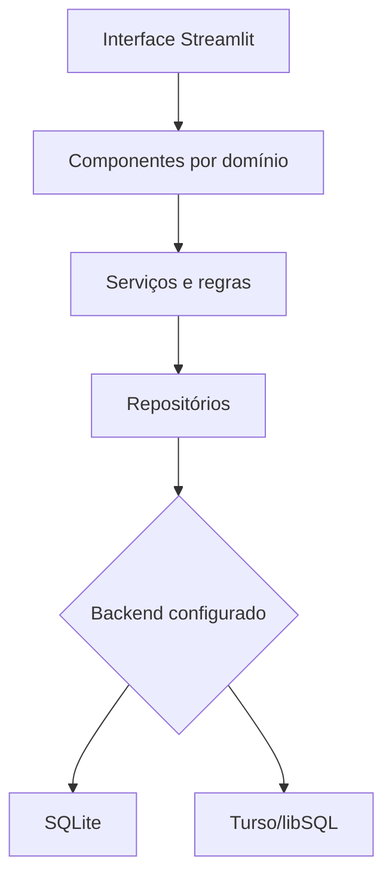

# Project Overview — FinanTec

## Visão geral

O FinanTec é uma aplicação web de organização financeira pessoal desenvolvida
com Python, Streamlit e pandas. A V1 está publicada para demonstração e utiliza
Turso/libSQL como persistência remota, mantendo compatibilidade com SQLite na
execução local.

O produto reúne em uma única interface:

- contas e autenticação;
- transações manuais e importadas;
- indicadores por período;
- orçamento mensal;
- metas financeiras;
- perfil financeiro;
- controle e exclusão dos próprios dados.

O projeto começou como um pipeline ETL para processar arquivos CSV. Esse
pipeline continua disponível, mas a aplicação passou a ser o principal meio de
entrada, consulta e gerenciamento dos dados.

## Problema e objetivo

Planilhas e anotações isoladas dificultam acompanhar receitas, despesas,
reservas, metas e limites mensais. Também aumentam o risco de registros
inválidos ou duplicados durante a consolidação das informações.

O FinanTec organiza esse fluxo:

```text
entrada manual ou arquivo
        ↓
validação e normalização
        ↓
análise de possíveis duplicatas
        ↓
persistência associada ao usuário
        ↓
indicadores e planejamento financeiro
```

O objetivo da V1 não é competir com bancos ou plataformas financeiras. Seu
escopo é demonstrar um produto funcional, com regras de negócio, persistência,
qualidade de dados, testes e decisões técnicas documentadas.

## Publicação e formas de acesso

A demonstração pública está disponível em:

[finantec-data-pipeline-immggyug2jwy78khudpv2s.streamlit.app](https://finantec-data-pipeline-immggyug2jwy78khudpv2s.streamlit.app/)

Existem dois tipos de conta.

### Conta temporária

- pode ser criada sem código de acesso;
- oferece acesso aos fluxos funcionais da aplicação;
- permanece válida por 24 horas a partir da criação;
- mantém os dados entre acessos durante esse período;
- apresenta um aviso com o tempo restante;
- tem a conta e os dados associados removidos após a expiração.

A remoção física acontece quando a aplicação executa sua rotina de verificação.
Não existe um processo agendado independente executando em segundo plano.

### Conta permanente

- exige o código configurado em `FINANTEC_REGISTRATION_CODE`;
- não possui expiração automática;
- preserva os dados até uma ação explícita de exclusão.

Esse modelo permite uma demonstração pública utilizável sem liberar a criação
irrestrita de contas permanentes.

## Fluxos de dados

### Dados pessoais

Os registros pessoais são associados ao `user_id` da conta autenticada. Um novo
usuário pode começar sem transações, perfil, metas ou orçamento; esses estados
vazios são válidos.

```text
conta autenticada
        ↓
contexto do usuário
        ↓
serviços e validações
        ↓
repositórios
        ↓
SQLite ou Turso
```

### Demonstração fictícia

O projeto também preserva dados fictícios para apresentação. Esse contexto é
separado dos dados pessoais e não deve sobrescrever registros do usuário.

Operações de escrita ficam bloqueadas quando o modo de demonstração somente
leitura está ativo.

### Importação

A entrada de arquivos utiliza um modelo canônico compartilhado pelos caminhos
de importação. São suportados:

- CSV no formato do FinanTec;
- Excel no formato do FinanTec;
- OFX;
- planilhas Excel externas por mapeamento assistido.

O fluxo inclui prévia, normalização, validação, separação de linhas inválidas e
identificação de possíveis duplicatas antes da persistência.

### ETL

O ETL não é necessário para iniciar a aplicação. Ele permanece como um comando
explícito para:

- processar os CSV de `data/raw/`;
- padronizar as transações com pandas;
- separar registros válidos e rejeitados;
- gerar os resultados em `data/processed/`;
- carregar os dados processados na persistência configurada.

## Domínios funcionais

### Transações

- cadastro manual;
- consulta e filtros por período;
- edição e exclusão;
- importação e exportação;
- validação e tratamento de possíveis duplicatas.

### Visão geral

- receitas, despesas, reserva e saldo;
- gastos por categoria;
- transações recentes;
- resumo do orçamento;
- análise por ano e mês.

### Orçamento

- limites mensais por categoria;
- edição, exclusão e recorrência entre períodos;
- comparação entre valor planejado e gasto real;
- identificação de saldo disponível ou limite excedido.

### Metas

- criação, acompanhamento, edição e exclusão;
- cálculo de progresso e valor restante;
- simulação de prazo ou contribuição mensal sem alterar a meta persistida.

### Perfil

- informações pessoais relacionadas ao planejamento;
- fontes de renda;
- renda mensal;
- informações sobre dívidas e cartão de crédito.

### Dados e privacidade

Existem duas operações destrutivas com responsabilidades distintas:

```text
Apagar meus dados
→ remove os dados financeiros e preserva a conta

Excluir conta
→ remove a conta e os dados associados
```

A exclusão coordenada considera transações, perfil, metas, orçamento e demais
registros vinculados ao usuário.

## Arquitetura atual



### Interface

`src/app.py` coordena autenticação, carregamento de dados, navegação e composição
das telas. Os componentes visuais ficam em `src/components/` e são separados
pelos principais fluxos do produto.

A interface possui temas claro e escuro e foi revisada para desktop, notebook
e dispositivos móveis.

### Regras e serviços

Validações e operações de persistência são mantidas fora dos componentes
puramente visuais sempre que possível. Serviços específicos coordenam cadastro,
importação, sincronização e manipulação das transações.

### Persistência

`src/database_connection.py` fornece a interface comum de conexão. O backend é
selecionado por `FINANTEC_DATABASE_BACKEND`:

| Valor | Uso |
|---|---|
| `sqlite` | Banco local em arquivo. Também é o padrão quando a variável não é informada. |
| `turso` | Banco remoto libSQL usado pela aplicação publicada. |

O Turso também exige `TURSO_DATABASE_URL` e `TURSO_AUTH_TOKEN`.

Os repositórios preservam a separação por domínio e recebem o contexto do
usuário para limitar leituras e escritas.

## Componentes principais

| Componente | Responsabilidade |
|---|---|
| `src/app.py` | Coordena o fluxo principal e a composição da interface. |
| `src/components/auth.py` | Cadastro, autenticação e interface de acesso. |
| `src/account_repository.py` | Contas, hashes de senha, tentativas de login e expiração. |
| `src/user_context.py` | Mantém o usuário autenticado e os dados necessários da sessão. |
| `src/database_connection.py` | Abstrai as conexões SQLite e Turso. |
| `src/transaction_repository.py` | Persiste e consulta transações. |
| `src/budget_repository.py` | Persiste e consulta limites mensais. |
| `src/goal_repository.py` | Persiste e consulta metas. |
| `src/profile_repository.py` | Persiste o perfil financeiro. |
| `src/data_reset.py` | Coordena remoção de dados e contas expiradas. |
| `scripts/etl_transacoes.py` | Executa o pipeline ETL explícito. |
| `tests/` | Reúne a suíte automatizada. |

## Segurança e privacidade

A V1 inclui proteções compatíveis com seu escopo:

- senhas armazenadas somente como hash;
- comparação segura das credenciais;
- bloqueio temporário após falhas consecutivas de login;
- consultas parametrizadas;
- separação dos registros por `user_id`;
- código de acesso para contas permanentes;
- expiração e limpeza de contas temporárias;
- secrets mantidos fora do repositório.

Essas medidas não transformam o projeto em uma plataforma financeira de
produção. Elas reduzem riscos concretos da demonstração pública.

## Decisão sobre IA externa

Uma versão anterior utilizou Gemini em um assistente financeiro. A integração
foi removida para evitar que perguntas e contexto financeiro fossem enviados a
um serviço externo sem benefício proporcional.

A aplicação atual não utiliza IA externa para processar os dados financeiros
cadastrados. O histórico e a justificativa estão registrados no
[ADR 001](decisions/001-remove-gemini-integration.md).

## Qualidade

A suíte atual possui 455 testes automatizados. A cobertura inclui:

- autenticação e ciclo de vida das contas;
- isolamento por usuário;
- SQLite e abstração para Turso;
- transações, importação e duplicatas;
- orçamento, metas e perfil;
- ETL, rejeições e cálculos financeiros;
- exclusão de dados;
- comportamento dos principais componentes Streamlit.

Os testes de persistência utilizam bancos temporários e não devem depender do
banco remoto configurado na máquina.

## Limitações atuais

A V1:

- não acessa bancos nem utiliza Open Finance;
- não executa operações financeiras;
- não possui recuperação de senha por e-mail;
- não possui verificação de e-mail ou telefone;
- não executa a limpeza das contas por um agendador externo;
- não possui testes extensivos de carga ou concorrência;
- não passou por pentest ou auditoria formal independente;
- depende das possibilidades de interface e sessão do Streamlit;
- não deve ser tratada como serviço financeiro ou plataforma de produção.

## Direção futura

A V1 deve permanecer como referência funcional enquanto o feedback dos testes
externos é coletado.

Uma futura V2 poderá separar frontend, API e persistência para oferecer maior
controle de interface, experiência de produto e evolução arquitetural. A stack
definitiva e a migração devem ser decididas a partir de necessidades concretas,
sem reescrever o sistema apenas para adicionar tecnologias.

Não são prioridades atuais:

- microserviços;
- Kubernetes;
- integração bancária;
- Open Finance;
- nova integração externa com IA;
- arquitetura empresarial multi-tenant.

## Status

A V1 está funcional, publicada e disponível para testes externos. Os fluxos
principais foram validados manualmente, e a suíte automatizada está passando.

O trabalho atual está concentrado no alinhamento da documentação e na
apresentação do projeto para portfólio.
